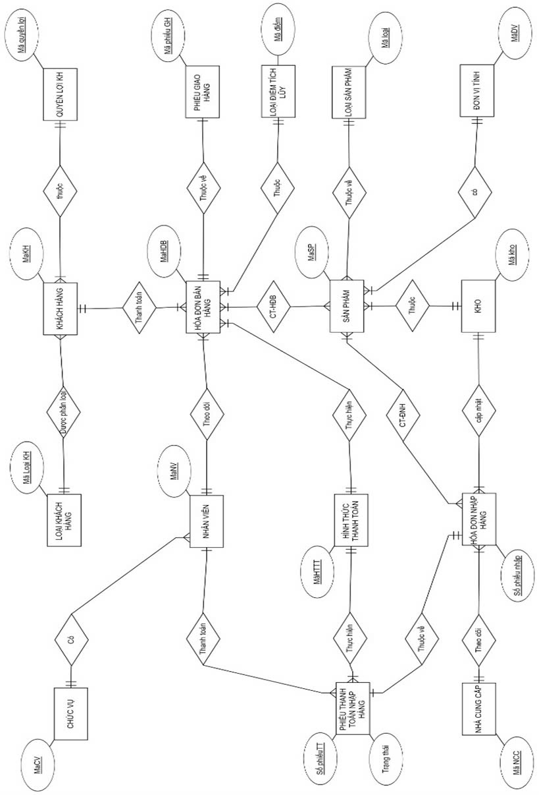

# supermarket-data-system
🎯 **Objective**: Build a relational database for supermarket operations using Oracle PL/SQL.

🧠 **Key Business Goals**:
- Manage products, customers, transactions, and employees
- Automate business rules using PL/SQL logic

🔧 **Technologies**: Oracle PL/SQL, Draw.io

📌 **My Contributions**:
- Designed Business Function Diagram (BFD), Entity Relationship Diagram (ERD)
- Wrote SQL scripts to create tables, procedures, and triggers
- Ensured data integrity through security triggers

📂 **Structure**:
- `scripts/`: Oracle SQL scripts
- `diagrams/`: BFD & ERD
- `docs/`: Project report and business requirements
<h4>📌 ERD - Entity Relationship Diagram </h4>

<h4>📌 BFD - Bidirectional Forwarding Detection</h4>

<h4>📌 Relational Data model</h4>

